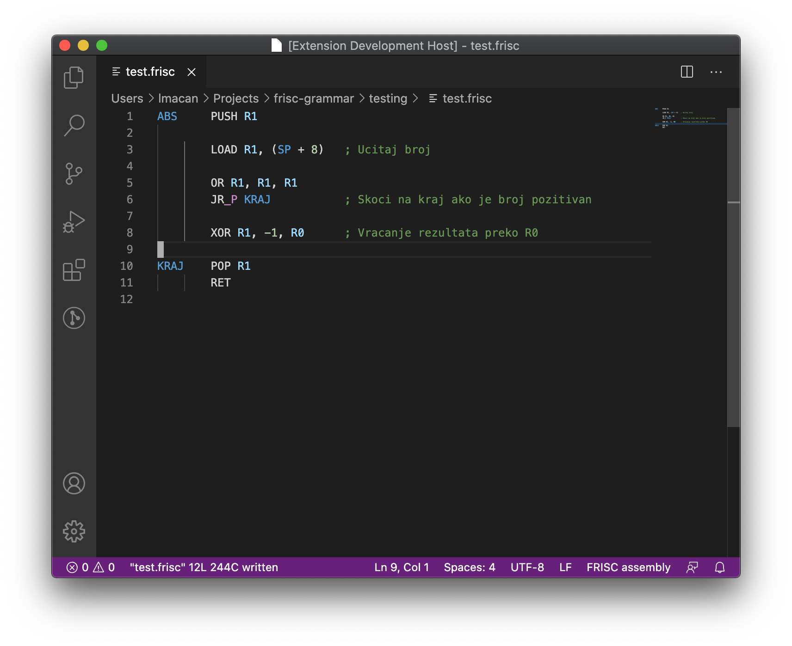

# FRISC

This extension gives Visual Studio Code support for FRISC assembly language.
FRISC is an educational ISA developed at University of Zagreb Faculty of Electrical Engineering and Computing.

## Features

### Syntax Highlighting

Registers, labels, conditions, comments are highlighted.



### Default VSCode configuration

The Atlas simulator requires that all FRISC assembly files use LF for newline and have a newline at the end of file.

This extension provides default configurations that satisfy that and are used only when programming with a FRISC assembly file.

## Install

Download .vsix file from the _Releases_ tab and run the command:
```
$ code --install-extension frisc-<version>.vsix
```

## Release Notes

### 1.0.0

Initial release of FRISC extension.